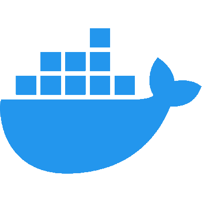

<!--
**plasmatech8/plasmatech8** is a ✨ _special_ ✨ repository because its `README.md` (this file) appears on your GitHub profile.

Here are some ideas to get you started:

- 🔭 I’m currently working on ...
- 🌱 I’m currently learning ...
- 👯 I’m looking to collaborate on ...
- 🤔 I’m looking for help with ...
- 💬 Ask me about ...
- 📫 How to reach me: ...
- 😄 Pronouns: ...
- ⚡ Fun fact: ...

Note: you can use `

` to center-align something.
-->

# Mark Connelly —— @plasmatech8

Hello there! 👋

My name is Mark (plasmatech8)

I am passionate about technology and I love writing clean and organised code.

##  GitHub Stats

(Stats based on public GitHub data)

##  Technologies

<!-- Programming Languages -->

<!-- Web Frameworks and Libraries -->

<!-- Platforms -->

<!-- Tools and Platforms -->

<!-- Data Science and Machine Learning -->

<!-- Databases and Backend Services -->

and more...

##  Donations

* PayPal: [paypal.me/MarkDConnelly](https://paypal.me/MarkDConnelly)
* BTC: bc1q05he6hjlx5gujwe28ur4547ssan4z0f8wwyzmu
* ETH: 0x3c073c0d269cdF0241271Bd9fe8C8F5F646A3865
* ALGO: BP47E3JYVM6ZEXNNXEPISBZGMBKIHV4L5NB57T7NCBYHAQKATZIKYQS6LI

